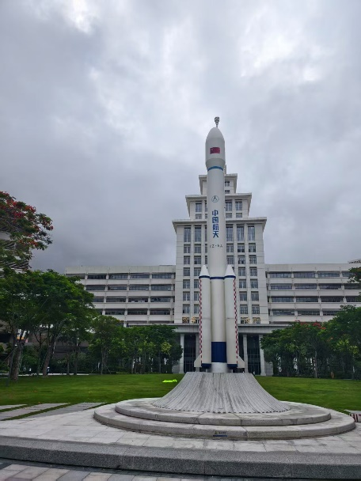
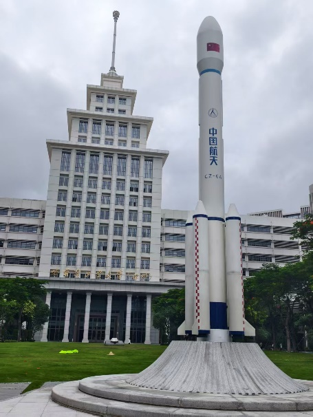
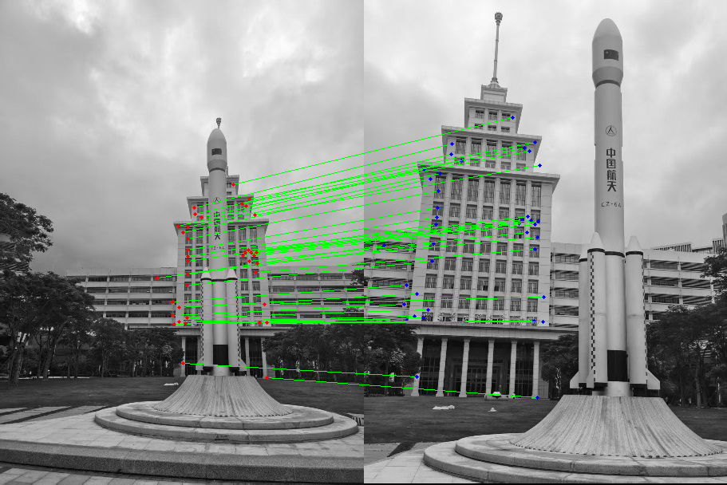
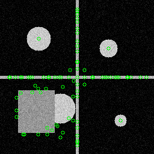
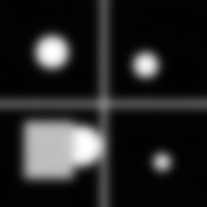
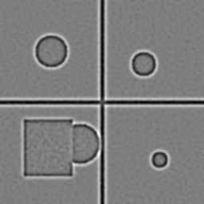
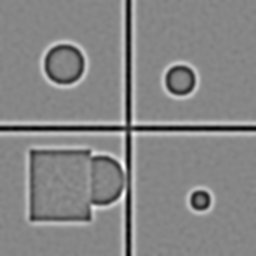
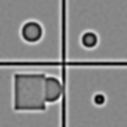

# CV Lab1 --- SIFT 特征匹配

本实验实现 **SIFT（Scale-Invariant Feature
Transform）特征提取算法**，并构建完整的特征匹配流程，包括
**最近邻比值检验（NNR）** 和 **RANSAC
几何一致性过滤**，最终对匹配结果进行可视化。

------------------------------------------------------------------------

# 项目结构

    lab1/
    ├── simple_sift/        # 从零实现的 SIFT 算法
    │   ├── gaussian_pyramid.py   # 高斯金字塔与 DoG 金字塔构建
    │   ├── keypoint_detection.py # DoG 极值点检测
    │   ├── descriptor.py         # 主方向分配 + 128维描述子
    │   └── main.py
    └── match/              # 特征匹配流程
        ├── runmatch.py     # 程序入口
        ├── matcher.py      # 最近邻比值匹配（NNR）
        ├── ransac.py       # RANSAC 单应性过滤
        ├── visualize.py    # 匹配结果可视化
        └── input/          # 输入图像 pic1.png, pic2.png

----------------------------------------------

# 运行环境及依赖库

| 项目   | 版本   |
| ------ | ------ |
| Python | 3.9.23 |
| OpenCV | 4.13.0 |
| NumPy  | 2.0.2  |

--------------------------

# 运行方法

### 1. 简单SIFT实现
``` bash
python simple_sift/main.py
```

### 2. 匹配任务
``` bash
python match/runmatch.py
```

程序会：

1.  读取 `match/input` 中两张图片\
2.  提取SIFT特征\
3.  执行NNR匹配\
4.  使用RANSAC过滤错误匹配\
5.  输出匹配结果图

------------------------------------------------------------------------

# 算法流程

    输入图像
       ↓
    SIFT特征点检测 + 描述子计算
       ↓
    NNR特征匹配（Nearest Neighbor Ratio Test）
       ↓
    RANSAC几何一致性过滤
       ↓
    匹配结果可视化

## 1. 特征提取

使用 OpenCV 的 `SIFT_create()` 提取关键点与描述子。\
每个关键点生成 **128维特征描述子**，并进行 **L2归一化**。

**输入图像：**

| pic1 | pic2 |
|------|------|
|  |  |

## 2. NNR匹配（最近邻比值检验）

匹配时寻找最近邻和次近邻，计算：

    d1 / d2 < ratio

若满足条件则保留匹配。常用参数：

    ratio = 0.7

## 3. RANSAC几何一致性过滤

使用：

    cv2.findHomography(..., cv2.RANSAC, 3.0)

估计单应性矩阵并剔除错误匹配。

## 4. 匹配结果可视化

最终匹配结果保存到 `match/output/matches.png`：



------------------------------------------------------------------------

# Simple SIFT 效果展示

## 输入图像


## 关键点检测结果



## 高斯金字塔（部分）

| octave0_scale0 | octave0_scale2 | octave0_scale4 |
|---|---|---|
|  |  |  |

## DoG 金字塔（部分）

| octave0_dog0 | octave0_dog1 | octave0_dog2 |
|---|---|---|
|  |  |  |

------------------------------------------------------------------------

# NNR阈值实验

| ratio | raw matches | inliers | inlier rate |
| ----- | ----------- | ------- | ----------- |
| 0.5   | 24          | 15      | 62.50%      |
| 0.6   | 43          | 26      | 60.47%      |
| 0.7   | 75          | 42      | 56.00%      |
| 0.8   | 115         | 48      | 41.74%      |
| 0.9   | 224         | 64      | 28.57%      |

实验结果表明：

-   ratio较小：匹配更严格，错误匹配较少\
-   ratio适中（约0.7）：匹配数量与精度较平衡\
-   ratio较大：错误匹配明显增加

因此常用：

    ratio ≈ 0.7

----------------------------------------------
